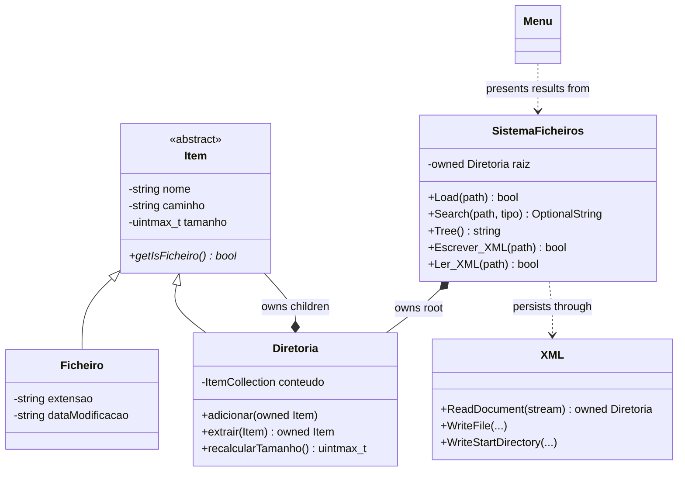

# File System Manager

A cross-platform C++17 console application that models a directory tree in
memory and safely coordinates queries, mutations, and XML persistence with the
physical file system.

This project began as an Object-Oriented Programming assignment and was later
reworked as a portfolio project. The current version focuses on explicit
ownership, clear domain boundaries, transactional operations, portable paths,
and automated characterization tests.

## Highlights

- Object-oriented domain model built around an abstract `Item` base class.
- Exclusive tree ownership expressed with `std::unique_ptr`.
- Value-based public API using `std::optional` and strongly typed enums.
- Exact path resolution for unambiguous searches and moves.
- Transactional batch renaming and defensive file-system operations.
- Robust XML import and export with validation and rollback behavior.
- Domain logic separated from the interactive console presentation.
- CMake presets and strict compiler warnings for reproducible builds.
- Automated tests and CI on Windows, Linux, and macOS.

## What the application can do

After loading a directory or a previously exported XML snapshot, the
application can:

- count files and directories and calculate the total byte size;
- identify the largest file and directories with notable statistics;
- search by exact relative or absolute path;
- list every file or directory with a given name;
- move files and directories while rejecting collisions and cycles;
- rename matching files as an all-or-nothing operation;
- copy batches of files and resolve destination-name collisions;
- remove matching items from the model and the physical file system;
- detect duplicate file names;
- render and save the directory tree;
- export the model to XML and restore it after full validation.

Example tree output:

```text
workspace
|-- documents
|   |-- report.pdf
|   `-- notes.txt
`-- images
    `-- diagram.png
```

> Some commands modify the physical file system. Use a disposable directory
> when exploring move, rename, copy, and remove operations.

## Architecture



`SistemaFicheiros` is the application-facing domain service. It owns the root
directory and protects tree invariants. `Diretoria` owns its children, while
`Ficheiro` stores file-specific metadata. `XML` handles persistence, and
`Menu` is responsible only for input and user-facing output.

See [Architecture](docs/architecture.md) for the ownership model, component
boundaries, and the main reliability decisions.

## Object-oriented design

- **Abstraction and polymorphism:** `Item` defines the common contract used by
  `Ficheiro` and `Diretoria`.
- **Encapsulation:** tree contents are exposed as a read-only view and changed
  through controlled ownership-transfer operations.
- **Composition:** a directory is composed of exclusively owned child items;
  the file-system model owns exactly one root.
- **Separation of concerns:** domain, console presentation, logging, utilities,
  and XML persistence have distinct responsibilities.
- **RAII:** memory, streams, temporary trees, and ownership transfers are tied
  to object lifetimes rather than manual cleanup.

The public API never returns owning raw pointers. Optional query results use
`std::optional`, item categories use `enum class`, collections are returned by
value, and read-only queries are `const`.

## Build and run

### Requirements

- CMake 3.22 or newer;
- a C++17 compiler: MSVC, GCC, or Clang;
- Ninja when using the included presets.

Configure and build a debug version:

```console
cmake --preset debug
cmake --build --preset debug
```

Run it on Windows:

```console
.\build\debug\bin\file_system_manager.exe
```

Run it on Linux or macOS:

```console
./build/debug/bin/file_system_manager
```

For an optimized build, replace `debug` with `release`. Both presets enable a
strict warning set and treat compiler warnings as errors.

If Ninja is unavailable, use a generator-independent build:

```console
cmake -S . -B build
cmake --build build --config Release
```

## Tests

Build the debug preset and run the test suite through CTest:

```console
cmake --preset debug
cmake --build --preset debug
ctest --test-dir build/debug --output-on-failure
```

The suite currently contains 30 characterization scenarios. It covers the
public API, statistics, wide byte sizes, exact paths, EOF handling, separation
of presentation and domain logic, symbolic-link cycles, ownership transfers,
physical mutations, and valid and invalid XML transactions.

See [Testing strategy](docs/testing.md) for the full test map and platform
notes.

## Reliability and portability

The implementation maintains several operational invariants:

- a failed load or XML import preserves the current in-memory tree;
- directory loading ignores symbolic links and tracks canonical identities;
- moves reject duplicate destinations and cyclic directory relationships;
- batch renaming validates every destination before committing any change;
- failed multi-step disk operations attempt to roll back completed steps;
- XML is first written to a temporary file and imported into a temporary tree;
- sizes and counts are recalculated after successful mutations;
- paths use `std::filesystem`, and platform-specific console setup is isolated.

The GitHub Actions workflow builds and tests the same source using MSVC on
Windows, GCC on Linux, and Clang on macOS.

## Repository structure

```text
.
|-- .github/workflows/   Cross-platform continuous integration
|-- docs/                Architecture and testing documentation
|-- include/             Public class declarations
|-- src/                 Domain, persistence, console, and utility code
|-- tests/               Automated characterization suite
|-- CMakeLists.txt       Build targets and compiler policy
|-- CMakePresets.json    Debug and release presets
`-- main.cpp             Application entry point
```

The reusable `file_system_manager_core` library contains the domain and
persistence code. The interactive menu is linked only into the executable and
the presentation-oriented tests.

## Project background

The first version was created for an academic Object-Oriented Programming
project. The portfolio version preserves the original problem domain while
substantially revising memory ownership, error handling, public interfaces,
file-system safety, XML validation, portability, build automation, and tests.

The original assignment document is intentionally not included. Requirements
are described here in original wording so the repository remains focused on
the implementation and respects the source material.

## Possible next steps

- split large domain operations into smaller services;
- add a non-interactive command-line interface;
- introduce structured error types for every mutating operation;
- benchmark very large directory trees;
- generate API reference documentation from public headers.

## Author

Developed by Guilherme Pereira.

## License

This project is available under the [MIT License](LICENSE).
