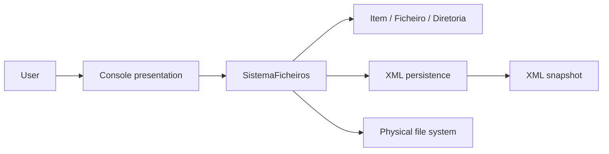
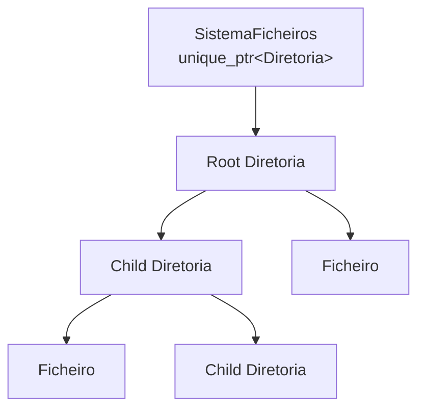
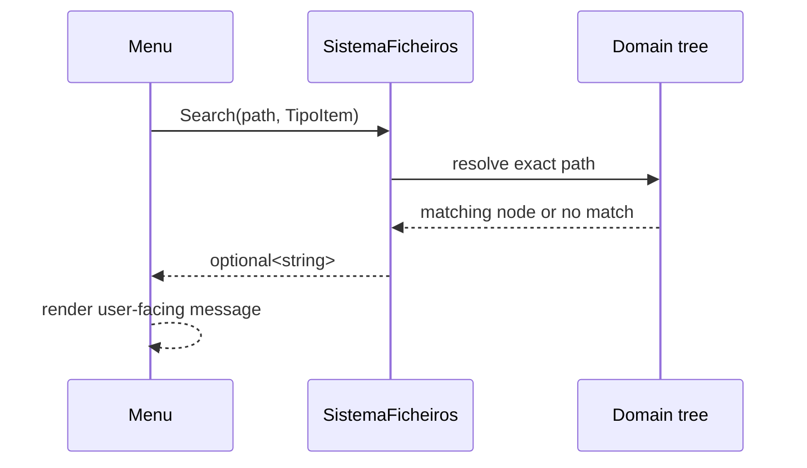

# Architecture

## Overview

File System Manager uses a small layered design. The interactive `Menu` reads
input and presents results, `SistemaFicheiros` coordinates use cases and
protects the domain model, and `XML` converts the model to and from a persistent
representation.

The core target deliberately excludes `Menu.cpp`. This makes the domain and
persistence code reusable without bringing console input and output into every
consumer.

## Domain model

### `Item`

`Item` is the abstract base for every node. It stores the shared name, path,
and byte-size state and provides the polymorphic `getIsFicheiro()` query.
Its virtual destructor makes destruction through the base type safe.

### `Ficheiro`

`Ficheiro` adds an extension and last-modification date. Its rename override
keeps extension metadata synchronized with the file name.

### `Diretoria`

`Diretoria` owns a list of `std::unique_ptr<Item>`. Copying is disabled because
a node has one unambiguous owner. Moving an item between directories is an
ownership transfer: the source extracts its `unique_ptr` and the destination
accepts it.

### `SistemaFicheiros`

`SistemaFicheiros` owns the root `Diretoria` and exposes the application use
cases. It resolves paths, coordinates memory and disk changes, recalculates
derived state, and returns results without writing to the console.

## Ownership

Every model node has exactly one owning path from the root. Raw pointers appear
only as short-lived, non-owning references during traversal or extraction.
Destruction of the root therefore releases the complete tree automatically.

## Query flow

Read-only operations are `const` and communicate absence explicitly:

Paths may be absolute or relative to the loaded root. The special path `.`
identifies the root. Exact resolution prevents repeated leaf names from causing
an arbitrary item to be selected.

## Mutation strategy

Operations that affect memory and disk are ordered to minimize divergence:

1. validate source paths, destination paths, names, and collisions;
2. prepare all required state before the first mutation;
3. update the physical file system;
4. commit the equivalent ownership change in memory;
5. recalculate derived directory sizes;
6. attempt rollback if a later physical step fails.

Batch renaming first validates the complete destination set, including
case-insensitive portable collisions. It then applies changes transactionally
and reverses completed renames if a later rename fails.

## XML persistence

Export writes a complete temporary document before replacing the requested
snapshot. Import parses into a temporary tree and swaps it into the active
model only after every element, attribute, size, name, nesting relationship,
and aggregate directory size has been validated.

This commit-at-the-end approach means a malformed document cannot partially
replace the active tree.

## Portability boundary

Paths and physical operations use `std::filesystem`. Platform-dependent code
is restricted to utility functions for UTF-8 console setup and thread-safe
date conversion, plus native Windows reparse-point detection where the MinGW
standard library cannot reliably distinguish directory aliases. CMake supplies
the correct thread library and the CI matrix exercises MinGW-w64 GCC on
Windows, GCC on Linux, and Apple Clang on macOS.
